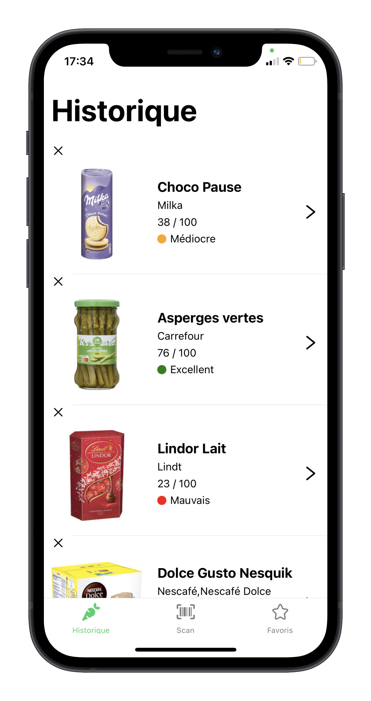
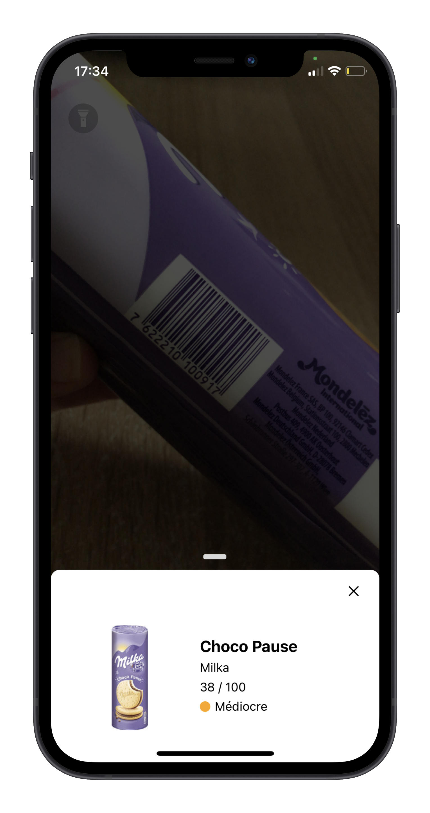
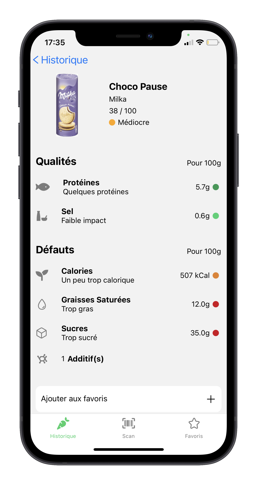

<h1 align="center">Yuka - Clone</h1>

## Overview

This project uses [OpenFoodFacts](https://fr.openfoodfacts.org/) API and allows to :

- Scan a product ( possibility to set the torch mode )
- View the nutritional value of the scanned product
- Visualise the scan history
- Add a scanned product to favorites

&nbsp;

## Screenshots of application

<p align="center">



</p>

&nbsp;

## Running the project

First make sure you have installed all dependencies and applications to run project on your computer : [Getting Started with Expo](https://docs.expo.io/get-started/installation/).

This project works fine for iOS but not on Android device because I've only worked on iOS.

Clone this repository :

```
git clone https://github.com/LaetitiaConstant/yuka.git
cd yuka
```

Install packages :

```
yarn
```

When installation is complete, run the application :

```
expo start
```

You can download **Expo Go** on your mobile and scan code or open **iOS simulator**.
